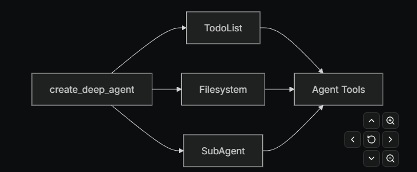

# UCSD Agent testing
## Notes

### Langchain's Deep Agents vs our own Implementation

**Deep Agent provides:**
- perfect Skills integration (just like Claude)
- planning/task-decomposition 
- long-term memory
- context management
- sub-agent spawning
- customizable backend (state/file-based)
- human-in-the-loop support
- [self-improving/modifying instructions/prompting](https://docs.langchain.com/oss/python/deepagents/long-term-memory#self-improving-instructions)
  
**Deep Agent Architecure:**

Todolist, Fileystem, and subagent are provided customizable middleware.[docs](https://docs.langchain.com/oss/python/deepagents/middleware)

### Tools vs Skills vs MCP server:

**[Tools](https://docs.langchain.com/oss/python/langchain/tools):**
Built in and supported by Langchain. The middleware for this is perfect and completely handled.

**[Skills](https://docs.langchain.com/oss/python/langchain/multi-agent/skills):**
For langchain/graph not Deep Agent: We'd have to build our own middleware. It'd be confusing for us to differentiate what we turn into a tool vs skill. A decent amount of intellectual overhead and would probably lead to bloat. I made an early attempt 

**[MCP Server](https://docs.langchain.com/oss/python/langchain/mcp):**
Can have multiple MCP servers. Use langchain mcp adapter and it allows langchain to just see/use/call them as regular langchain tools.

It seems like an agent can't add/initialize new MCP servers during runtime, as the MCP servers are loaded and transformed into tools and then passed to the agent during the agent's intitialization. 

### Relevant Langchain Functionality

- Can force [structured output](https://docs.langchain.com/oss/python/langchain/structured-output)
- [Prompt chaining/states](https://docs.langchain.com/oss/python/langgraph/workflows-agents) for predetermined workflows. Can also add parallel nodes/states
- [Routing](https://docs.langchain.com/oss/python/langgraph/workflows-agents#routing) for smart routing of queries/text via structured output
- [Orchestrator+worker](https://docs.langchain.com/oss/python/langgraph/workflows-agents#orchestrator-worker) can force orchestrator to follow a strict planning schema and then can pass subsections onto specific workers
- [Evaluator+optimizer](https://docs.langchain.com/oss/python/langgraph/workflows-agents#evaluator-optimizer) by using structured output + nodes

[Useful docs on their multi-agent techniques](https://docs.langchain.com/oss/python/langchain/multi-agent#router-2)

## Current Architecture

Based on a langchain tutorial on how to add skills(+ skill middleware) to an agent. [Link](https://docs.langchain.com/oss/python/deepagents/middleware)

Langchain agent with tools and skill middleware. The middleware looks at the request, identifies if any skills is relevant, and then loads the skill definition into context for the agent. Then the agent can call tools using the task and loaded skill definitions as context

**Current tools:**
- `curl`: As named
- `load-skill`: As named, but isn't currently called because the middleware bypasses it.

**Current skills:**
- `get-weather`: a claude skill which I copied/downloaded

## Setup
Conda environment for clean local dev environments


```
conda create -n "agents_ucsd" python==3.11
conda activate agents_ucsd
pip install -r requirements.txt
python main.py
```

